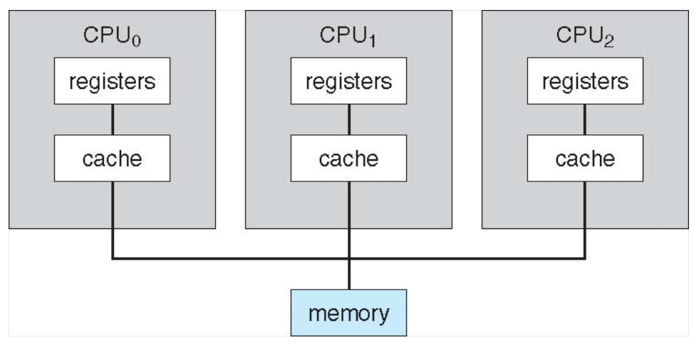

# Chapter 1: Introduction

## Objectives

- To describe the basic organization of computer systems
- To provide a grand tour of the major components of operation systems
- To give an overview of the many types of computing environments
- To explore several open-source operating systems

## What is an Operating System?

- A program that acts as an intermediary between a user of a computer and the computer hardware
- Operating system goals:
  - Execute user programs and make solving user problems easier
  - Make the computer system convenient to use
  - Use the computer hardware in an *efficient* manner

## Computer System Structure

- Computer System can be divided into four components:
    1. Hardware - provides basic computing resources
        - CPU, memory, I/O devices
    1. Operating system
        - Controls and coordinates use of hardware among various applications and users
    1. Application programs - define the ways in which the system resources are used to solve the computing problems of the users
        - Word processors, compilers, web browsers, database systems, video games
    1. Users
        - People, machines, other computers

## Four Components of a Computer System

## What Operating Systems Do

- Depends on the point of view
- Users want convenience, *ease of use*, and *good performance*
  - Don't care about *resource utilization*
- But shared computers, such as a *mainframe*, or *minicomputer* must keep all users happy
- Users of dedicated systems such as *workstations* have dedicated resources but frequently use shared resources from *servers*
- Handheld computers are *resource poor*, optimized for usability and battery life
- Some computers have little or not user interface, such as embedded computers in devices and automobiles

## Operating System Definition

- OS is a **resource allocator**
  - Manages all resources
  - Decides between conflicting requests for efficient and fair resource use
- OS is a **control program**
  - Controls execution of programs to prevent errors and improper use of the computer
- No universally accepted definition
- "Everything a vendor ships when you order an operating system" is a good approximation, but varies wildly
- "The one program running at all times on the computer" is the **kernel**
- Every else is either:
  1. A system program (ships with the operating system), or
  1. An application program.

## Computer Startup

- **Bootstrap program** is loaded at power-up or reboot
  - Typically stored in ROM or EPROM, generally known as **firmware**
  - Initializes all aspects of system
  - Loads operating system kernel and starts execution

## Computer System Organization

- Computer-system operation
  - One or more CPUs, device controllers connect through common bus providing access to shared memory

## Computer System Operation

- I/O devices and the CPU can execute concurrently
- Each device controller is *charge of a particular device type*
- Each device controller has a *local buffer*
- CPU moves data from/to main memory to/from local buffers
- I/O is from the device to local buffer of controller
- Device controller informs CPU that it has finished its operation by causing an **interrupt**

## Common Functions of Interrupts

- Interrupt transfers control to the interrupt service routine generally, through the **interrupt vector**, which contains the addresses of all the service routines
- Interrupt architecture must save the address of the interrupt instruction
- A **trap** or **exception** is a software-generated interrupt caused either by an error or a user request
- An operating system is **interrupt drive**

## Interrupt Handling

- The operating system preserves the state of the CPU by storing registers and the program counter
- Determines which type of interrupt has occurred:
  1. **Polling**
  1. **Vectored** interrupt system
- Separate segments of code determine what action should be taken for each type of interrupt

## Interrupt Timeline

## I/O Structure

- After I/O starts, control returns to user program only upon I/O completion
  - **Wait instruction** idles the CPU until the next interrupt
  - **Wait loop** (contention for memory access)
  - At most one I/O request is outstanding at a time, no simultaneous I/O processing
- After I/O starts, control returns to user program without waiting for I/O completion
  - **System call** - request to the OS to allow the user to wait for I/O completion
  - **Device-status table** contains entry for each I/O device indicating its type, address and state
  - OS indexes into I/O device table to determine device status and to modify table entry to include interrupt

## Storage Structure

- **Main memory** - only large storage media that the CPU can access directly
  - **Random access**, typically **volatile**
- **Secondary storage** - extension of main memory that provides large **nonvolatile** storage capacity
- Hard disks - rigid metal or glass platters covered with magnetic recording material
  - Disk surface is logically divided into **tracks**, which are subdivided into **sectors**
  - The **disk controller** determines the logical interaction between the device and the computer
- **Solid-state disks** - faster than hard disks, nonvolatile
  - Various technologies
  - Becoming more popular

## Storage Hierarchy

- Storage systems organized in hierarchy
  - Speed
  - Cost
  - Volatility
- **Caching** - copying information into faster storage system; main memory can be viewed as a cache for secondary storage
- **Device Driver** for each device controller to manage I/O
  - Provides uniform interface between controller and kernel

## Caching

- Important principle, performed at many levels in a computer (in hardware, opearting system, software)
- Information in use copied from slower to faster storage temporarily
- Faster storage (cache) checked first to determine if information is there
  - If it is, information is used directly from the cache (fast)
  - If not, data is copied to cache and used there
- Cache smaller than storage being cached
  - Cache management important design problem
  - Cache size and replacement policy

## Direct Memory Access Structure

- Used for high-speed I/O devices able to transmit information at close to memory speeds
- Device controller transfer blocks of data from buffer storage directly to main memory without CPU
- Only one interrupt is generated per block, rather than the one interrupt per byte

## How a Modern Computer Works

## Computer-System Architecture

- Most systems use a single general-purpose processor
  - Most systems have special purpose processors as well
- **Multiprocessor** system growing in use and importance
  - Also known as **parallel systems**, **tightly-coupled systems**
  - Advantages include:
    1. **Increased throughput**
    1. **Economy of scale**
    1. **Increased reliability** - graceful degradation of fault tolerance
  - Two types:
    1. **Asymmetric Multiprocessing** - each processor is assigned a specific task.
    1. **Symmetric Multiprocessing** - each processor performs all tasks.

## Symmetric Multiprocessing Architecture

## A Dual-Core Design

- Multi-chip and **Multicore**
- Systems containing all chips
  - Chassis containing multiple separate systems

## Clustered Systems

- Like multiprocessor systems, but multiple systems working together
  - Usually sharing storage via a **storage-area network (SAN)**
  - Provides a **high-availability** service which survives failures
    - **Asymmetric clustering** has one machine in hot-standby mode
    - **Symmetric clustering** has multiple ndoes running applications, monitoring each other
  - Some clusters are for **high-performance computing (HPC)**
    - Applications must be written to use **parallelization**
  - Some have **distributed lock manager (DLM)** to avoid conflicting operations

## Operating System Structure

- **Multiprogramming (Batch system)** needed for efficiency
  - Single user cannot keep CPU and I/O devices busy at all times
  - Multiprogramming organizes jobs (code and data) so CPU always has one to execute
  - A subset of total jobs in system is kept in memory
  - One job is selected and run via **job scheduling**
  - When it has to wait (for I/O for example), OS switches to another job
- **Timesharing (multitasking)** is logical extension in which CPU switches jobs so frequently that users can interact with each job while it is running, creating **interactive** computing.
  - **Response time** should be <1 second
  - Each user has at least one program executing in memory: **process**
  - If several jobs are ready to run at the same time: **CPU scheduling**
  - If processes don't fit in memory, **swapping** moves them in and out to run
  - **Virtual memory** allows execution of processes not completely in memory

## Operating-System Operations

- **Interrupt drive** (hardware and software)
  - Hardware interrupt by one of the devices
  - Software interrupt (**exception** or **trap**):
    - Software error (i.e. division by zero)
    - Request for operating system service
    - Other process problems include infinite loop, processes modifying each other or the operating system
- **Dual-mode** operation allows OS to protect itself and other system components
  - **User mode** and **kernel mode**
  - **Mode bit** provided by hardware
    - Provides ability to distinguish when system is running user code or kernel code
    - Some instructions designated as **privileged**, only executable in kernel mode
    - System call changes mode to kernel, return from call resets it to user
- Increasingly CPUs support multi-mode operations
  - I.e. **virtual machine manager (VMM)** mode for guest **VMs**

## Transition from User to Kernel Mode

- Timer to prevent infinite loop / process hogging resources
  - Timer is set to interrupt the computer after some time period
  - Keep a counter that is decremented by the physical clock.
  - Operating system set the counter (privileged instruction)
  - When counter zero generate an interrupt
  - Set up before scheduling process to regain control or terminate program that exceeds allotted time

## Process Management

- A process is a program in execution. It is a unit of work within the system. Program is a **passive entity**, process is an **active entity*.
- Process needs resources to accomplish its task
  - CPU, memory, I/O, files
  - Initialization data
- Process termination requires reclaim of any reusable resources
- Single-threaded process has one **program counter** specifying location of next instruction to execute
  - Process executes instructions sequentially, one at a time, until completion.
- Multi-threaded process has one program counter per thread
- Typically system has many processes, some user, some operating system running concurrently on one or more CPUs
  - Concurrently by multiplexing the CPUs among the processes / threads

## Process Management Activities

The operating system is responsible for the following activities in connection with process management:

- Creating and deleting both user and system processes
- Suspending and resuming processes
- Providing mechanisms for process synchronization
- Providing mechanisms for process communication
- Providing mechanisms for deadlock handling

## Memory Management
